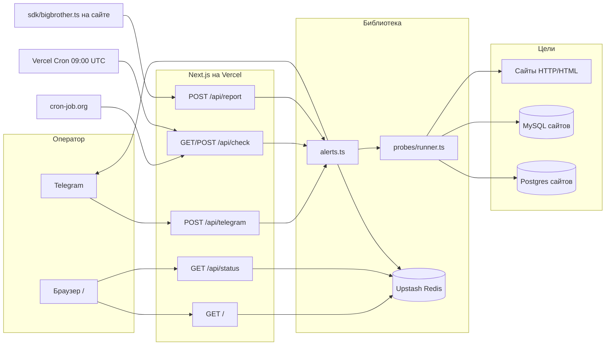
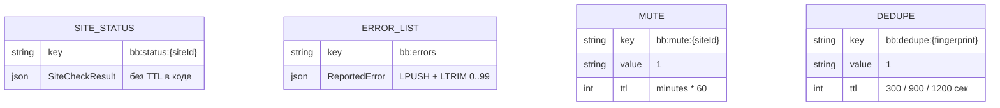

# Big Brother

Личный монитор нескольких сайтов одного автора: HTTP-пинг, scrape HTML, бюджеты ассетов, crawl внутренних ссылок, синтетические формы/API, проверка MySQL/Postgres и приём runtime-ошибок. Основной канал управления — Telegram-бот; веб-страница только показывает последние статусы. Крутится как одно Next.js-приложение на Vercel Hobby, состояние держит в Upstash Redis, тяжёлый headless-браузер сознательно не используется.

## Паспорт проекта

| Поле | Значение |
|------|----------|
| Название | Big Brother (`package.json` → `"name": "bigbrother"`, `"version": "0.1.0"`, `"private": true`) |
| Тип | Личный продукт / операционный монитор собственных сайтов. В репозитории нет договора, брифа хакатона, учебного задания и коммерческих метрик. |
| Роль автора | Владелец репозитория — [odkiii](https://github.com/odkiii) (Ivan B). Feature-коммиты помечены `Co-authored-by: Cursor Agent` и `Co-authored-by: Ivan B`. В коде сам монитор целиком: фронт (одна SSR-страница), бэк (4 API-роута + библиотека проб), интеграция Redis/Telegram, конфиги `probes/*.json`, деплой `vercel.json`. Отдельного дизайнера, аналитика, DBA и тестов в репо нет. |
| Сроки | Первый коммит `270c9b7` — 2026-09-01 22:49 +0300. Последний коммит в `main` — `010a1a0` (merge PR #1, 2026-09-02 17:52 +0300). Открытый PR #2 (`aea9193`, 2026-09-14) добавляет сайт Droptext и на момент этого README **не влит в `main`**. Итераций по git: 5 коммитов на всех ветках, 2 pull request. |
| Статус | Задеплоен: GitHub homepage репозитория указывает на `https://bigbrother-phi.vercel.app`. PR #1 влит в `main`. Это не публичный SaaS: звёзд 0, форков 0, issues 0, лицензии нет. Живой трафик, SLA и «продакшен в штате» **не зафиксированы в репо**. |
| Ссылки | GitHub: https://github.com/odkiii/bigbrother · демо/деплой (homepage GitHub): https://bigbrother-phi.vercel.app · бот: токен в env `TELEGRAM_BOT_TOKEN`, username бота **не зафиксирован в репо** · API: `/api/check`, `/api/report`, `/api/status`, `/api/telegram` на том же хосте |
| Стек (lock `package-lock.json`, lockfileVersion 3) | `next` **16.3.4**, `react` / `react-dom` **19.2.8**, `@upstash/redis` **1.38.3**, `cheerio` **1.2.0**, `mysql2` **3.24.2**, `postgres` **3.4.9**, `zod` **4.5.4**, `tailwindcss` **4.3.3**, `typescript` **5.9.3**, `eslint` **9.39.5**, `eslint-config-next` **16.3.4**. В `package.json` также `@tailwindcss/postcss` ^4, `@types/node` ^20, `@types/react` ^19. |
| Инфраструктура | Vercel (Hobby, `vercel.json` cron раз в сутки). Upstash Redis REST. Telegram Bot API. Внешний cron (в README коммита `230b419` указан cron-job.org) для интервала ~5 мин, потому что Vercel Cron на Hobby ограничен. MySQL/Postgres — не своя БД монитора, а **подключение к БД мониторируемых сайтов** по URL из env. Docker / Nginx / Prisma / Firebase / Neon как сервис этого репо **отсутствуют**. GitHub Actions workflow **нет**. |

Язык интерфейса дашборда: `lang="ru"` в `src/app/layout.tsx`, тексты страницы и бота на смеси русского и английского. Репозиторий публичный, топики GitHub не заданы, GitHub Pages выключены.

## Задача и контекст

Проект появился как ответ на ограничение Vercel Hobby: нельзя дёшево читать логи сразу нескольких проектов и нельзя часто дергать Vercel Cron. Это прямо сказано в README коммита `230b419`: на Hobby нет Pro Log Drains, cron — раз в сутки, поэтому нужен внешний бесплатный cron на `/api/check` и свой Redis.

Боль на входе: несколько живых сайтов автора на разных хостингах (Onreza / Vercel / «other»), и нужно знать не только «корень отдаёт 200», но и что HTML не содержит PHP/Next/SQL-ошибку, что CSS/JS не 404, что форма/API/БД живы, и что клиентский runtime не падает молча. Формального ТЗ, issue-трекера и хакатон-брифа в репозитории нет (GitHub Issues пустой). Сдача по факту: влитый PR #1 «Big Brother: монитор сайтов + Telegram-алерты» (https://github.com/odkiii/bigbrother/pull/1, merged 2026-09-02) и указанный homepage на Vercel.

Роли пользователей в коде две, обе не моделируются таблицей users:

1. **Оператор монитора** — человек в Telegram (`TELEGRAM_CHAT_ID`, опционально whitelist `TELEGRAM_ALLOW_USER_IDS`) и тот, кто открывает дашборд. Авторизации на `/` и `/api/status` нет.
2. **Мониторируемый сайт** — машина, которая либо пассивно проверяется пробами, либо активно шлёт ошибки на `POST /api/report` с `REPORT_SECRET`.

Что считалось сдачей: рабочий деплой, список из четырёх сайтов в `src/lib/sites.ts`, бот с командами `/status` `/check` `/deep` `/full`, Redis-состояние, SDK в `sdk/`. Пользовательские аккаунты, биллинг, мультиаренда — вне скоупа.

## Путь разработки от начала до сдачи

Хронология по `git log --all`, не по воображаемому roadmap.

1. **Пустой репозиторий.** `270c9b7` (2026-09-01): файл `README.md` из одной строки `# bigbrother`. GitHub-репозиторий создан в 19:45 UTC того же дня. Каркаса приложения ещё нет.

2. **Первый рабочий монитор, один коммит.** `230b419` (2026-09-01 19:57 UTC), PR #1 открыт в ту же минуту. Это не «сначала схема БД»: своей SQL-схемы нет. Появились Next.js App Router (`src/app/layout.tsx`, `src/app/page.tsx`), четыре API-роута, `src/lib/health.ts` (HTTP GET с timeout 18 с), `src/lib/redis.ts`, `src/lib/telegram.ts`, `src/lib/alerts.ts`, `src/lib/sites.ts` с четырьмя сайтами, `sdk/bigbrother.ts`, `.env.example`, `vercel.json` с cron `0 9 * * *` на `/api/check`. Зависимости тогда: Next, React, Upstash Redis, Zod — без cheerio/mysql2/postgres.

3. **Первые сущности — сайты, не таблицы.** В `DEFAULT_SITES` сразу четыре записи: `zvezda-na-elku` (IDN через punycode `xn-----6kcbhmgfkc3blw3g.xn--p1ai`, host `onreza`), `doctor-ekazheva` (onreza), `kateramika` (host `other`), `deal-poizon-delivery` (host `vercel`). Экран один: список сайтов + «Recent errors». Telegram-команды первого дня: `/status`, `/check`, `/errors`, `/mute`, `/chatid` (см. `src/app/api/telegram/route.ts` уже в этом коммите; глубокие `/deep` `/full` `/probes` дописаны следующим).

4. **Слой глубоких проб через ~12 минут.** `9141648` (2026-09-01 20:09 UTC). В `package.json` добавлены `cheerio`, `mysql2`, `postgres`. Появились `src/lib/probes/*` и `src/lib/types.ts` с типами `PageProbe` / `FormProbe` / `ApiProbe` / `DbProbe`. JSON-конфиги `probes/<siteId>.json`. README переписан: акцент «не только ping». В `vercel.json` путь cron стал `/api/check?mode=deep`. `src/app/api/check/route.ts` получил `maxDuration = 60` и режимы `shallow|deep|full`.

5. **Что ломалось и как чинили — в git почти не видно отдельных bugfix-коммитов.** Между `230b419` и `9141648` нет «fix timeout» / «fix 401». Единственный явный эволюционный фикс в том же PR: Hobby-cron раз в сутки недостаточен для 5-минутного контроля, поэтому в README остаётся инструкция на внешний cron-job.org, а Vercel Cron оставлен как дневной подстраховочный прогон. В `src/lib/probes/page.ts` fetch-timeout отдельно от бюджета TTFB: `Math.max(probe.maxTtfbMs ?? 0, 18_000)` — комментарий прямо говорит «slow hosts like Onreza». Это заложено сразу в deep-слое, не отдельным hotfix.

6. **Рефакторинга схемы БД не было:** SQL-миграций в репо нет. «Рефакторинг» — расширение типов в `src/lib/types.ts` (+148 строк в `9141648`) и переход `runHealthSweep` с голого HTTP на `runAllSiteProbes`. Runner гоняет сайты **пачками по 2**, чтобы уложиться в Hobby duration (`src/lib/probes/runner.ts`).

7. **Внешние API.** Telegram: `fetch https://api.telegram.org/bot${token}/sendMessage` в `src/lib/telegram.ts`. Redis: REST-клиент `@upstash/redis`. Сайты — обычный `fetch`. Подключения `mysql2` / `postgres` открываются на время одной пробы и закрываются (`sql.end`, `conn.end`). SDK не публикуется в npm: файл копируют в целевой проект (`sdk/README.md`).

8. **Деплой.** `vercel.json` есть с первого feature-коммита. GitHub homepage = `https://bigbrother-phi.vercel.app`. В репо нет `Dockerfile`, нет `.github/workflows`. Preview Vercel на PR фиксируется ботом Vercel (комментарии к PR), не Actions.

9. **Сдача в `main`.** Merge-коммит `010a1a0` (2026-09-02): squash/merge PR #1 с двумя коммитами внутри. После этого `main` = полный монитор с deep probes и четырьмя сайтами.

10. **Следующая итерация, ещё не в `main`.** `aea9193` на ветке `cursor/droptext-site-monitor-67a4`, PR #2 (https://github.com/odkiii/bigbrother/pull/2, OPEN на момент написания): сайт `droptext` → `https://www.droptext.site`, файл `probes/droptext.json` с селекторами `#plate` / `input.file-input`, API-пробами `/api/transcribe` (GET 405 и POST без файла → 400) и env `DROPTEXT_DATABASE_URL`. Это единственный конфиг, где `apis` и `assets` не пустые и asserts не сводятся к `body`.

11. **Что показали / задеплоили.** Публичный URL на Vercel задан в настройках GitHub. Скриншотов, записи демо и чеклиста приёмки в репо нет. Команда `/deep` в боте и `GET /api/check?mode=deep` — фактический «acceptance» для оператора.

12. **Этот README** — отдельная документация для портфолио; поведение приложения не меняет.

## Архитектура

Слои внутри одного Next.js-процесса (runtime `nodejs` на API-роутах check/telegram):

```
Оператор (Telegram / браузер)
        │
        ├─ POST /api/telegram  → команды → runHealthSweep / Redis mute / listErrors
        ├─ GET  /              → Server Component читает Redis, рисует статусы
        └─ GET  /api/status    → JSON тех же статусов (без авторизации)
        
cron-job.org ──► GET /api/check?mode=deep   (Bearer CRON_SECRET)
Vercel Cron  ──► GET /api/check?mode=deep   (раз в сутки 09:00 UTC)

Мониторируемый сайт ──► POST /api/report    (Bearer REPORT_SECRET)
        │
        ▼
src/lib/alerts.ts  runHealthSweep / ingestReportedError
        │
        ├─ src/lib/probes/runner.ts  (shallow / deep / full)
        │     ├─ health.ts          HTTP корня
        │     ├─ probes/page.ts     cheerio + asserts
        │     ├─ probes/assets.ts   размер/время CSS JS img
        │     ├─ probes/forms.ts    discover | POST
        │     ├─ probes/api.ts      synthetics
        │     ├─ probes/db.ts       mysql2 | postgres | http
        │     └─ probes/crawl.ts    только mode=full
        │
        ├─ Upstash Redis  ключи bb:*
        └─ Telegram sendMessage
```

Контейнеров нет: ни `docker-compose`, ни sidecar. Очереди кроме Redis LIST `bb:errors` нет. Вебхук один — Telegram. Внешние БД сайтов вызываются **из монитора**, секреты живут только в env монитора (`.env.example`), в JSON пишутся имена переменных (`urlEnv`, заголовок `env:NAME`).



Что ходит куда:

| Кто | Куда | Зачем |
|-----|------|--------|
| Внешний cron / Vercel Cron | `GET /api/check?mode=deep` + `Authorization: Bearer CRON_SECRET` или `?secret=` | Регулярный прогон |
| Telegram | `POST /api/telegram?secret=TELEGRAM_WEBHOOK_SECRET` | Команды оператора |
| Сайт / SDK | `POST /api/report` + `REPORT_SECRET` | Push runtime-ошибок |
| Дашборд | Redis `bb:status:*`, `bb:errors` | Показ без отдельного API-ключа |
| Пробы | публичные URL сайтов; опционально `*_DATABASE_URL` | Синтетика |

## Frontend — что и как сделано

Фронтенд намеренно узкий: «Primary UX is Telegram» написано на самой странице (`src/app/page.tsx`). Это не SPA с роутером.

**Страницы**

| Маршрут | Файл | Зачем |
|---------|------|--------|
| `/` | `src/app/page.tsx` | Единственный экран: список сайтов, цветной индикатор, последние findings, блок Recent errors |
| layout | `src/app/layout.tsx` | Шрифты Geist / Geist Mono через `next/font/google`, `metadata.title = "Big Brother"`, тёмный `bg-zinc-950` |
| стили | `src/app/globals.css` | Tailwind v4 `@import "tailwindcss"`, CSS-переменные zinc |

Других маршрутов App Router (логин, настройки, страница сайта) **нет**. Клавиатуры Telegram inline не используются: `answerTelegramCallback` объявлен в `src/lib/telegram.ts`, но `POST` вебхука читает только `update.message` и **игнорирует `callback_query`**. Команды — текстовые, см. Backend.

**Стейт.** Redux / Zustand / Vue / FSM на клиенте нет. Страница — async Server Component с `export const dynamic = "force-dynamic"`: каждый запрос заново читает Redis. Клиентских `'use client'` компонентов в `src/app` нет. «Стейт» живёт в Redis и в Telegram-чате.

**Формы на дашборде.** Их нет: нельзя запустить проверку, замутить сайт или залогиниться из браузера. Пустое состояние: серая точка и текст `No check yet — /deep in Telegram`; для ошибок — `No stored errors.` Валидация пользовательского ввода на фронте не нужна, потому что ввода нет. Ошибки проб показываются списком до 6 findings на сайт (`st.findings.slice(0, 6)`), моноширинным мелким шрифтом.

**Авторизация на клиенте.** Отсутствует. Кто знает URL деплоя, видит имена сайтов, URL и последние сообщения проб. `/api/status` отдаёт тот же набор без секрета. Защищены только `/api/check`, `/api/report` и опционально вебхук бота.

**Адаптив / Mini App / SSR.** SSR через RSC, без Telegram Mini App. Вёрстка `max-w-3xl px-4`: узкая колонка, не проработанные брейкпоинты. Отдельной мобильной версии нет.

**Ключевые «компоненты»** — не библиотека UI, а разметка прямо в `HomePage`: точка-статус (`bg-emerald-500` / `bg-amber-400` / `bg-red-500` / `bg-zinc-500`), ссылка на сайт `target="_blank"`. Сценарий оператора в UI: открыл `/` → увидел цвета → если красный, читает findings → чинит сайт → ждёт следующий cron или идёт в Telegram `/deep`.

SDK (`sdk/bigbrother.ts`) — это фронт **чужих** сайтов, не дашборда: `window.error`, `unhandledrejection`, опциональный `wrapFetch` (репортит HTTP ≥ 500 и сеть), `reportFormFailure`. Инициализация `initBigBrother({ endpoint, secret?, siteId })`. Рекомендуемый путь в `sdk/README.md`: same-origin proxy `/api/bb-report` на целевом сайте, чтобы не светить `REPORT_SECRET` в браузере. Факт подключения SDK на реальных сайтах (есть ли файл в kateramika/zvezda) **в этом репо не зафиксирован** — есть только инструкция.

## Backend — что и как сделано

Четыре Route Handler’а. Общего ORM нет. Секреты сравниваются через `crypto.timingSafeEqual` в `src/lib/auth.ts`. Если `CRON_SECRET` / `REPORT_SECRET` **не задан**, `requireSecret` возвращает `false` → всегда 401 (проверка не «открывается в dev без секрета»).

### HTTP API

| Метод и путь | Вход | Выход | Зачем |
|--------------|------|--------|--------|
| `GET\|POST /api/check` | Query `mode=shallow\|deep\|full` (default `deep`), `site=<siteId>`; секрет Bearer / `x-bigbrother-secret` / `?secret=` = `CRON_SECRET` | `{ ok, mode, checked, alertsSent, results[] }` | Прогон проб + алерты. `maxDuration = 60`. Неизвестный `site` → 404. |
| `POST /api/report` | JSON Zod: `siteId`, `message` (1–2000), опц. `stack` (max 8000), `url` (500), `source` enum, `meta`; секрет = `REPORT_SECRET` | `{ ok, stored, alerted, id }` | Приём ошибок с сайтов. Неизвестный `siteId` → 400. |
| `GET /api/status` | нет | `{ ok, sites: [...site, lastCheck], recentErrors }` | JSON дашборда, **без секрета**. |
| `POST /api/telegram` | Telegram Update JSON; если задан `TELEGRAM_WEBHOOK_SECRET`, нужен `?secret=` | `{ ok: true }` или 401/400 | Бот. Не-message апдейты глотаются (`ok: true`). |

### Команды бота (`src/app/api/telegram/route.ts`)

| Команда | Вход | Поведение |
|---------|------|-----------|
| `/start` `/help` | — | Текст справки |
| `/status` | — | Последние статусы из Redis |
| `/sites` | — | Список id/name/url/host |
| `/probes [siteId]` | опц. id | Сводка `describeProbeConfig`: counts pages/forms/apis/dbs/assets/crawl |
| `/errors [n]` | n по умолчанию 10, max 30 | Хвост `bb:errors` |
| `/check [siteId]` | опц. фильтр | `mode=shallow` (только HTTP) |
| `/deep [siteId]` | опц. | scrape + forms + api + db + assets |
| `/full [siteId]` | опц. | deep + crawl |
| `/mute <siteId> [minutes]` | minutes default 60 | Redis TTL на `bb:mute:{id}` |
| `/unmute <siteId>` | | `DEL` mute-ключа |
| `/chatid` | | Печатает chat id и user id — способ узнать `TELEGRAM_CHAT_ID` |

Whitelist: если `TELEGRAM_ALLOW_USER_IDS` пуст, пускают всех; иначе `Access denied.` Неизвестная команда → `Unknown command. Try /help`. Исключения ловятся и уходят в чат как `Bot error: …`.

### Бизнес-правила статусов (`runner.ts` `finalize`)

- `up` — корень жив и нет failed findings с `severity: critical`.
- `degraded` — нет critical fail, но есть failed `warning` (медленный TTFB, тяжёлый ассет, title mismatch, и т.п.).
- `down` — HTTP корня не 2xx/3xx **или** есть critical fail.
- `unknown` — в Redis ещё нет ключа (дашборд).

Алерты (`alerts.ts`):

- Down: дедуп 15 мин (`claimDedupe` NX+TTL) **или** переход с up/degraded → down; плюс запись в `bb:errors` с `source: "probe"`.
- Degraded: дедуп 20 мин, без обязательного «recovery»-исключения кроме общего up-сообщения.
- Recovery: предыдущий down/degraded и сейчас up → `🟢 OK again`.
- Runtime error: дедуп 5 мин по отпечатку `siteId|message|url`; mute глушит алерт, запись в список всё равно делается.
- Сообщения Telegram режутся до 4000 символов (`truncate`).

Таймауты: health 18 с (в коде ещё неиспользуемая константа `DEFAULT_TIMEOUT_MS = 12_000` в `health.ts`); page fetch ≥ 18 с; form submit 15 с; api default 12 с; db http 10 с; postgres `connect_timeout: 10`; asset `maxMs + 2000`. Crawl: `maxPages` ограничивается `Math.min(..., 10)`.

Ретраев сетевых запросов **нет**: один `fetch`, ошибка = finding. Параллельность: пробы одного сайта — `Promise.all`; сайты — чанки по 2.

### Интеграции

- **Telegram Bot API** — только `sendMessage` и неиспользуемый `answerCallbackQuery`. В БД бота ничего не пишется, кроме Redis. Parse mode не HTML/Markdown: сырой текст, `disable_web_page_preview: true`.
- **Upstash Redis REST** — единственное хранилище монитора.
- **MySQL / Postgres целевых сайтов** — `SELECT 1 AS ok` (или свой `query` из JSON). Если env нет, проба **ok: true** с текстом `Skipped — set env …` (не падает монитор).
- **Сайты** — `User-Agent: BigBrotherMonitor/1.0` (health) и `/2.0 (+synthetic-probes|+asset-probe|+form-probe|+api-probe|+db-http)`.
- **SDK** — исходящий POST на `/api/report`.

Подстановки в полях форм/API: `{{timestamp}}`, `{{iso}}`, `{{uuid}}` (`applyPlaceholders`). Заголовки `env:VAR` резолвятся в `process.env`.

### Обработка ошибок

- HTML-сигнатуры в `DEFAULT_ERROR_SIGNATURES` (`probes/html.ts`): Fatal/Parse error PHP, Uncaught Error, Next `Unhandled Runtime Error`, PrismaClient, SQLSTATE, mysqli_, Traceback, и широкие «Something went wrong» / «Server Error» — первое совпадение, `kind: html_error`, critical.
- Формы дополнительно ищут SQLSTATE / Fatal error / Integrity constraint в теле ответа.
- JSON API: `expectJsonPath` вида `$.ok` (разбор точечный, без JSONPath-библиотеки).
- Невалидный JSON вебхука/report → 400. Ошибки бота не роняют процесс.
- SDK глотает свои fetch-ошибки (`catch { /* swallow */ }`), чтобы не зациклить репорт.

### Что сознательно не стали делать

README и PR #1 прямо: **без Puppeteer / headless Chrome** на Hobby (дорого). Вместо этого cheerio + синтетический POST + SDK. Browserless упомянут как возможный следующий слой, в коде его нет. Также нет: очереди (Bull/Inngest), дашборда с кнопками, OAuth, GitHub Actions тестов, npm-публикации SDK, CORS-настройки, rate limit кроме Telegram-дедупа, обработки `callback_query`.

Движок форм и API **реализован**, но в JSON на `main` у всех четырёх сайтов `"forms": []` и `"apis": []`. Примеры живых форм/API есть только в `probes/README.md`. Реальный непустой `apis` появляется в PR #2 (`probes/droptext.json`).

## База данных

Своей СУБД у Big Brother **нет**. Prisma / миграции / `schema.sql` **не зафиксированы в репо**. Монитор — Redis-ключ/значение. SQL используется только как **внешняя health-проба** чужих баз.

### Почему Redis, а не SQL

Коммит `230b419` и `.env.example`: Upstash Redis free, REST, без отдельного сервера. Нужны TTL (mute, дедуп) и короткий список ошибок — это естественные Redis SET NX EX и LIST.

### «Сущности» Redis (не таблицы)



Поля `SiteCheckResult` (`types.ts`): `siteId`, `status` (`up|down|degraded|unknown`), `httpStatus`, `latencyMs`, `error`, `checkedAt`, `url`, `probeSummary { total, failed, warnings }`, `findings[]` (в Redis кладутся только **неуспешные**, max 40, `meta` обрезается).

Поля `ReportedError`: `id` (UUID), `siteId`, `message`, `stack?`, `url?`, `source` (`client|server|probe|unknown`), `meta?`, `receivedAt`.

Индексов SQL нет. JSONB нет. Enum статусов — TypeScript, не CHECK constraint.

### Миграции

Порядок миграций: **не применимо, файлов миграций нет**. Смена «схемы» = деплой нового кода, который пишет те же ключи. Обратной совместимости версий Redis-документов отдельным version field нет.

### Критичные запросы

| Где | Что |
|-----|-----|
| `probes/db.ts` | `SELECT 1 AS ok` / `select 1 as ok` (postgres default); `sql.unsafe(q)` — произвольный query из JSON, поэтому JSON не должен содержать секретов, только имена env |
| `probes/*.json` на main | `ZVEZDA_DATABASE_URL`, `DOCTOR_DATABASE_URL` → mysql; `KATERAMIKA_DATABASE_URL`, `DEAL_POIZON_DATABASE_URL` → postgres |
| Redis | `SET bb:status:{id}`, `GET` того же; `LPUSH`/`LRANGE`/`LTRIM` ошибок; `SET NX EX` дедупа; `SET EX` mute |

`ILIKE`, `where userId`, upsert пользователей — **нет**, пользователей в хранилище нет.

Если Redis env не задан, `getRedis()` возвращает `null`: статусы не сохраняются, дедуп всегда «свежий» (`claimDedupe` → `true`), mute не работает, дашборд вечно «No check yet», при этом Telegram-алерты из текущего прогона всё равно могут уйти. Это написано warn-логом в `redis.ts`.

Не в SQL также: сами HTML-страницы и ассеты не кэшируются; конфиги проб — файлы `probes/*.json` плюс опциональный env `PROBES_JSON` / `SITES_JSON`.

## Навыки, которые здесь применялись

### Frontend

- **React Server Components + App Router (Next 16)** → `src/app/page.tsx`: async-компонент, `force-dynamic`, никакого клиентского бандла страницы. Сделано так, чтобы дашборд всегда читал свежий Redis, а не статически закэшировался на Hobby.
- **Условный UI статусов** → цветовая точка и срез findings. Пустые состояния заложены явно, без скелетонов и библиотек таблиц.
- **Tailwind CSS v4** → `@import "tailwindcss"` + `@theme inline` в `globals.css`, утилиты zinc в разметке. Отдельного дизайн-системного пакета нет.
- **Копируемый клиентский SDK** → слушатели `error` / `unhandledrejection`, обёртка `fetch`, `keepalive: true` на beacon-подобных POST. Документирован proxy-паттерн, чтобы секрет не попал в браузер.
- **Метаданные и шрифты Next** → `next/font/google` Geist, `Metadata` title/description. Не лендинг-маркетинг, а служебная страница.

### Backend

- **Проектирование многослойных health-проб** → `runner.ts` собирает findings разных `ProbeKind`, сводит к `up/degraded/down`. Режимы shallow/deep/full разделяют стоимость (crawl только full).
- **Парсинг HTML без браузера** → cheerio: селекторы, title, извлечение same-origin CSS/JS/img и внутренних `<a href>`.
- **Синтетические HTTP-клиенты** → формы (сбор hidden + POST urlencoded, `redirect: "manual"`), API (JSON/text asserts, `expectStatus` включая 405), бюджеты ассетов по `content-length` или `arrayBuffer`.
- **Интеграция Telegram webhook** → разбор команд, whitelist user id, mute, запуск тех же `runHealthSweep`, что и cron — один код для кнопки человека и для расписания.
- **Безопасность секретов** → `timingSafeEqual`, Bearer или query, Zod на report, запрет неизвестного `siteId`, env-ссылки вместо паролей в JSON.
- **Дедуп и антишум** → Redis SET NX с разными TTL на down / degraded / error, чтобы не флудить чат при каждом 5-минутном cron.
- **Ограничения serverless** → `maxDuration = 60`, пачки по 2 сайта, cap crawl 10 страниц, compact findings для Redis.
- **TypeScript-контракты** → `src/lib/types.ts` описывает JSON проб; загрузчик `probes/load.ts` читает каталог с диска (`readFileSync` + `readdirSync`) — для Vercel это файлы, попавшие в деплой.

### Базы данных

- **Выбор Redis как operational store** → статусы, кольцевой лог ошибок (max 100), TTL mute/dedupe. Понимание, что монитору не нужна нормализованная SQL-схема пользователей.
- **Подключение к чужим MySQL и Postgres из serverless** → короткий пул `max: 1`, `ssl: "prefer"` для postgres, обязательный `end()` в `finally`, чтобы не держать слоты Hobby.
- **Health SQL** → `SELECT 1` как минимальная проверка сети/учётки; в README проб предложен `information_schema` count, но в рабочих JSON его нет.
- **Graceful skip** → отсутствие `*_DATABASE_URL` не красит сайт в down, а пишет skip-finding ok. Это важное правило для поэтапного наполнения секретов.
- **Опасность `sql.unsafe`** → query берётся из доверенного JSON репозитория, не из пользовательского ввода; секреты только через `urlEnv`.

## Принятые решения и компромиссы

1. **Next.js на Vercel вместо отдельного воркера / Docker.** Один репозиторий, один деплой, те же роуты для cron и бота. Цена: лимит длительности 60 с и холодные старты; отсюда пачки по 2 сайта и отказ от Playwright.

2. **Cheerio вместо Puppeteer.** Зафиксировано в README: Hobby не тянет Chrome. Не исполняется клиентский JS: SPA, которые рисуют контент только после гидрации, могут дать ложный «селектор не найден». Для текущих PHP/Next-сайтов автора это принято.

3. **Внешний cron каждые 5 мин + Vercel Cron раз в сутки.** Hobby не даёт 5-минутный Vercel Cron. Дневной cron в `vercel.json` (`0 9 * * *`) — страховка, не основной ритм. Фактический 5-минутный job живёт вне репо (cron-job.org); его UUID/аккаунт **не зафиксирован в репо**.

4. **JSON-конфиги на сайт, а не UI конструктор проб.** Добавление проверки = правка `probes/<id>.json` + деплой. Быстро для автора, плохо для нетехнического оператора.

5. **Формы и API в коде есть, в прод-конфигах `main` пустые.** Сдача deep-слоя опередила наполнение селекторов: четыре сайта проверяют в основном `body` + error signatures + `SELECT 1`. Droptext в PR #2 — первый плотный конфиг (селекторы пластины, transcribe API).

6. **Дашборд без авторизации.** Компромисс «это личный URL». Утечка списка сайтов и текстов ошибок, если URL угадан. `/api/status` открыт.

7. **SDK копипастой, не пакет.** Нет semver-публикации; расхождение копий на сайтах неизбежно. В репо нет подтверждения, что proxy `/api/bb-report` реально задеплоен на целевых доменах.

8. **Хеш дедупа — простой polynomial hash, не crypto.** `hashLite` в `alerts.ts` (умножение на 31). Коллизии возможны; для антифлуда в одном чате сочтено достаточным.

9. **Широкие HTML-сигнатуры.** Паттерн `Something went wrong` может ложно сработать на маркетинговый текст. В конфигах нет per-site disable, только `scanErrors`.

10. **Мёртвый код.** `DEFAULT_TIMEOUT_MS` не используется (eslint warning при локальном lint). `answerTelegramCallback` не вызывается. `checkAllSites` в `health.ts` после появления runner, скорее всего, не нужен роутам (роуты идут в `runHealthSweep`).

Что бы переписать: вынести прогон в очередь с ретраями; закрыть `/` и `/api/status` секретом; наполнить формы/API под реальные заявки Onreza; заменить copy-paste SDK на пакет; добавить интеграционные тесты на fixture HTML; убрать ложные сигнатуры или сделать их warning.

## Что доведено до конца, что нет

**Работает (код написан и влит в `main`):**

- Реестр 4 сайтов, override `SITES_JSON`.
- HTTP health + deep/full runner.
- Telegram-команды списка выше.
- Redis статусы/ошибки/mute/dedupe при заданных Upstash env.
- Zod-валидируемый `/api/report`.
- Загрузка `probes/*.json` + `PROBES_JSON`.
- MySQL/Postgres/http DB probes со skip без env.
- Тёмный SSR-дашборд.
- Vercel cron daily `mode=deep`.
- Инструкции webhook/cron в README (этот файл) и `.env.example`.

**Частично / тонко:**

- Конфиги проб четырёх сайтов: homepage `assert: body`, пустые forms/apis. Crawl и assets включены, но без уникальных селекторов.
- SDK есть, факт встраивания на сайты в этом репо не виден.
- Vercel homepage задан; аптайм самого монитора и число алертов в проде не логируются отдельно.

**Заглушки / нет:**

- Тестов (`*.test.ts` / CI job) нет. `npm test` не существует. Есть только `npm run lint` и `next build`.
- Docker, migrate, seed — нет.
- Лицензия, CODEOWNERS, issue templates — нет.
- Inline-кнопки Telegram — тип есть, обработка нет.
- Puppeteer/Browserless — нет.
- Ключи в git не закоммичены: `.gitignore` игнорирует `.env*` кроме `.env.example`. Секретов в истории feature-файлов при просмотре не видно.
- Пользователи, биллинг, мобильное приложение — вне скоупа.
- Droptext — **не в `main`**, только PR #2.

**Локально замеченный долг:** неиспользуемый `DEFAULT_TIMEOUT_MS`; открытый `/api/status`; UA в health всё ещё `BigBrotherMonitor/1.0` vs `2.0` у проб.

## Как запустить

Требования: Node.js (в репо версия движка не зафиксирована, только `@types/node` ^20), npm. Docker-команд нет.

```bash
git clone https://github.com/odkiii/bigbrother.git
cd bigbrother
npm install
cp .env.example .env.local
```

Имена переменных (значения не копировать из чужих env; в `.env.example` они пустые):

```
TELEGRAM_BOT_TOKEN
TELEGRAM_CHAT_ID
TELEGRAM_ALLOW_USER_IDS          # опционально, CSV user id
TELEGRAM_WEBHOOK_SECRET          # опционально
CRON_SECRET                      # обязателен для /api/check
REPORT_SECRET                    # обязателен для /api/report
UPSTASH_REDIS_REST_URL
UPSTASH_REDIS_REST_TOKEN
SITES_JSON                       # опциональный override списка
PROBES_JSON                      # опциональный override проб
ZVEZDA_DATABASE_URL              # mysql, опционально
DOCTOR_DATABASE_URL              # mysql, опционально
KATERAMIKA_DATABASE_URL          # postgres, опционально
DEAL_POIZON_DATABASE_URL         # postgres, опционально
DEAL_POIZON_INTERNAL_SECRET      # в JSON main не используется; задуман как env: в headers
```

В PR #2 дополнительно: `DROPTEXT_DATABASE_URL`. Миграций нет — `migrate` запускать нечего. Seed нет.

```bash
npm run dev      # Next.js, по умолчанию http://127.0.0.1:3000
npm run lint
npm run build
npm run start    # production-режим после build, тот же порт 3000
```

На `http://127.0.0.1:3000/` должна открыться страница «Big Brother» со списком четырёх сайтов. Без Redis все индикаторы серые, «No check yet». Без `CRON_SECRET` запрос к `/api/check` вернёт 401.

Разовый прогон (после заполнения секрета):

```bash
curl -sS "http://127.0.0.1:3000/api/check?mode=deep&secret=CRON_SECRET"
curl -sS "http://127.0.0.1:3000/api/check?mode=full&site=kateramika" \
  -H "Authorization: Bearer CRON_SECRET"
```

Webhook бота (подставить домен деплоя):

```bash
curl "https://api.telegram.org/bot${TELEGRAM_BOT_TOKEN}/setWebhook?url=https://YOUR-APP.vercel.app/api/telegram?secret=${TELEGRAM_WEBHOOK_SECRET}"
```

Внешний cron каждые 5 минут (как в исходном README):

`GET https://YOUR-APP.vercel.app/api/check?mode=deep`  
заголовок `Authorization: Bearer CRON_SECRET`.

Vercel Cron из репо: ежедневно в 09:00 UTC, тот же path. Авторизацию для платформенного cron Vercel **в коде отдельно не обходит**: если платформа не пришлёт секрет, handler ответит 401. Как именно Hobby вызывает cron с секретом — **не зафиксировано в репо** (нет `crons` auth middleware). Имеет смысл дублировать внешним cron с явным Bearer.

Деплой: `vercel` / GitHub integration. Файл `vercel.json` уже в корне.

## Артефакты для портфолио

Текст, который можно почти дословно перенести в резюме (без звёзд и выдуманных KPI):

- Спроектировал и задеплоил на Vercel Hobby многосайтовый монитор (Next.js 16 / React 19): HTTP, HTML-scrape (cheerio), бюджеты ассетов, crawl, синтетические формы и API, MySQL/Postgres probes.
- Сделал Telegram-бота как основной UX: команды `/deep` `/full` `/mute`, webhook с опциональным secret и whitelist user id; тот же `runHealthSweep`, что и cron.
- Вынес состояние в Upstash Redis (статусы, кольцевой лог ошибок, TTL mute/dedupe), без своей SQL-схемы.
- Описал конфиги проб JSON-файлами на сайт и правило «секреты только имена env».
- Написал клиентский SDK ловли `window.onerror` / unhandledrejection / failed fetch с прокси-секретом.
- Уложился в ограничения serverless: `maxDuration` 60, прогон сайтов пачками по 2, отказ от Puppeteer.
- Закрыл секреты `timingSafeEqual` + Zod на входящий report.

Истории на собеседование (проблема → что сделал → чем кончилось), только из кода/git:

1. **Hobby не даёт частый cron и log drain.** Сделал внешний cron на `/api/check` + свой Redis + бот. В `vercel.json` оставил суточный cron как подстраховку. Итог: PR #1 влит, деплой на `bigbrother-phi.vercel.app`.
2. **«Сайт открылся, но внутри PHP Fatal / битая форма».** Добавил слой cheerio-сигнатур, form POST и DB `SELECT 1` (`9141648`). Итог: движок есть; наполнение forms/apis на четырёх сайтах ещё пустое — честный пробел.
3. **Алерты будут дублироваться каждые 5 минут, пока сайт лежит.** Redis `SET NX EX` 15/20/5 минут и mute. Итог: повторный down с тем же отпечатком молчит до TTL, recovery шлёт `OK again`.
4. **Нельзя светить `REPORT_SECRET` в браузере.** SDK + инструкция same-origin proxy, который подставляет Bearer с сервера. Итог: паттерн описан; факт внедрения на каждом домене в этом репо не доказан.
5. **Нужен пятый сайт без переписывания движка.** Реестр `DEFAULT_SITES` + `probes/<id>.json`. PR #2 добавляет Droptext с проверкой `/api/transcribe` без вызова speech-модели (ожидаемые 405/400). На момент README PR открыт.

Скриншоты, которые стоит снять с **реального** деплоя или `npm run dev` (не генерировать фейковые):

1. Дашборд `/` со списком четырёх сайтов и цветными точками после `/deep`.
2. Тот же экран в состоянии «No check yet» (без Redis) — чтобы показать пустое состояние.
3. Чат Telegram: ответ `/help`, затем `/status` и `/deep kateramika`.
4. JSON `/api/status` (можно замазать URL, если не хотите светить).
5. Кусок `probes/zvezda-na-elku.json` рядом с `src/lib/probes/runner.ts` — «конфиг vs движок».
6. Vercel project settings с именами env (без значений) и `vercel.json` cron.
7. Если сольёте PR #2 — дашборд с пятой строкой Droptext и findings по transcribe.

---

Проверка полноты этого файла: что это — личный монитор сайтов; как устроено — Next.js + Redis + Telegram + JSON-пробы; вклад — весь репозиторий, co-author Cursor Agent; стек — версии из lock выше; путь — коммиты 2026-09-01 → merge 09-02 → PR Droptext 09-14; фронт — одна SSR-страница; бэк — четыре роута и библиотека проб; БД — Redis + внешний SELECT 1. Где факт не найден, это сказано явно.
